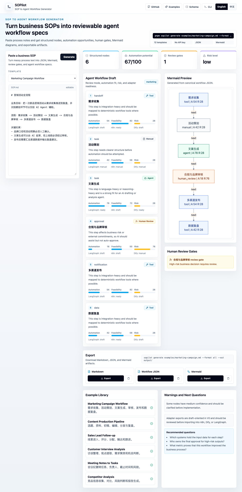

# SOPilot

**Turn messy business SOPs into structured, reviewable, exportable AI agent workflow specs.**

[中文说明](README.zh-CN.md) · [Quick Start](#quick-start) · [Examples](#examples) · [Schema](docs/schema.md) · [Adapter Roadmap](docs/adapter-roadmap.md)


SOPilot is an open-source **SOP-to-Agent Workflow Generator**. Paste a SOP, meeting note, or business process and get a structured workflow draft your product, business, data, and engineering teams can review together.

> Not another AI copywriter. SOPilot sits before n8n, Dify, and LangGraph: it turns fuzzy business text into diffable workflow specs.



## Before / After

```text
Input:
"需求收集 -> 活动策划 -> 文案生成 -> 审核 -> 发布 -> 数据复盘"

Output:
- 6 structured SOP nodes
- AI automation opportunity map
- Agent / Tool / Human Review design
- Human review gates
- Mermaid workflow diagram
- Exportable workflow.json, sop.json, evaluation.json, flow.mmd, report.md
```

## What You Get

- **Structured SOP JSON** for business process facts.
- **Agent workflow spec** with Agent / Tool / Human Review / Manual nodes.
- **Automation opportunity map** with feasibility, risk, and confidence scores.
- **Human gates** for approvals, risky outputs, and external commitments.
- **Mermaid diagram** generated from canonical workflow JSON.
- **Markdown / JSON / Mermaid exports** for review, docs, and handoff.
- **English / Chinese Web UI** for open-source discovery and Chinese interview demos.

## Why It Exists

AI workflow projects often fail before implementation: the business process is fuzzy, ownership is unclear, risky nodes are not reviewed, and generated workflows are hard to diff.

SOPilot focuses on the upstream design layer:

```text
Business SOP -> Structured SOP -> AI opportunity map -> Agent workflow draft -> Human gates -> Exports
```

It does not try to replace workflow platforms. It creates a clean, reviewable spec that can later be mapped to n8n, Dify, LangGraph, or internal automation systems.

## Quick Start

```bash
pnpm install
pnpm build
pnpm dev
```

Open the local web app and paste a SOP. The default demo path does **not** require an API key.

Run the CLI:

```bash
pnpm sopilot generate examples/marketing-campaign.md --format all --out output/
```

List built-in templates:

```bash
pnpm sopilot templates
```

Generate all example output bundles:

```bash
pnpm generate:examples
```

## Outputs

SOPilot exports canonical artifacts instead of raw LLM text:

| File | Purpose |
| --- | --- |
| `sop.json` | Business process facts: actors, systems, nodes, edges, inputs, outputs |
| `workflow.json` | Agent / Tool / Human Review / Manual workflow design |
| `evaluation.json` | Coverage, ambiguity, automation potential, warnings, next questions |
| `flow.mmd` | Mermaid workflow diagram |
| `report.md` | Readable handoff for business, product, and engineering review |

## Examples

The repository includes 12 first-run SOP templates:

1. Marketing campaign workflow
2. Content production pipeline
3. Sales lead follow-up
4. Customer interview analysis
5. Meeting notes to tasks
6. Competitor analysis
7. Support ticket triage
8. Recruiting resume screening
9. Product requirement analysis
10. Weekly data report
11. User feedback clustering
12. PRD review risk check

See [docs/examples.md](docs/examples.md) for the example index and generated artifact map.

## For AI PM Interviews

SOPilot demonstrates the full AI product manager loop for marketing enablement:

```text
Business interview -> SOP structuring -> AI opportunity analysis -> Agent workflow design -> Human review -> IT/data handoff
```

The marketing campaign example is the golden case, but the project is intentionally general enough for sales, support, recruiting, product, analytics, and operations workflows.

## For Developers

SOPilot is designed to be easy to inspect, test, and extend:

- Shared `packages/core` for schemas, deterministic parser, evaluator, and exporters.
- Web demo and CLI use the same canonical generation path.
- Zod schemas keep outputs typed, validated, and diffable.
- Adapter roadmap keeps n8n / Dify / LangGraph exports honest instead of promising runnable imports too early.

## Monorepo Structure

```text
apps/web              # Next.js Web Demo
packages/core         # Zod schemas, parser, evaluator, exporters
packages/cli          # sopilot generate
examples              # Built-in SOP templates
docs                  # Schema, examples, adapter roadmap
.github/workflows     # CI
```

## Development

```bash
pnpm lint
pnpm typecheck
pnpm test
pnpm build
```

Generate JSON Schema files:

```bash
pnpm schema
```

## Roadmap

- V0: schema, Web demo, CLI, examples, JSON / Markdown / Mermaid export.
- V0.2: LangGraph draft exporter.
- V0.3: experimental n8n JSON for common nodes.
- V0.4: Dify workflow draft after format stability review.

See [docs/adapter-roadmap.md](docs/adapter-roadmap.md).

## What V0 Does Not Do

- No user accounts
- No database
- No enterprise workflow execution engine
- No visual workflow canvas
- No production-ready n8n / Dify / LangGraph import yet

V0 stays focused on structure, automation opportunities, human gates, and exports.

## License

MIT
