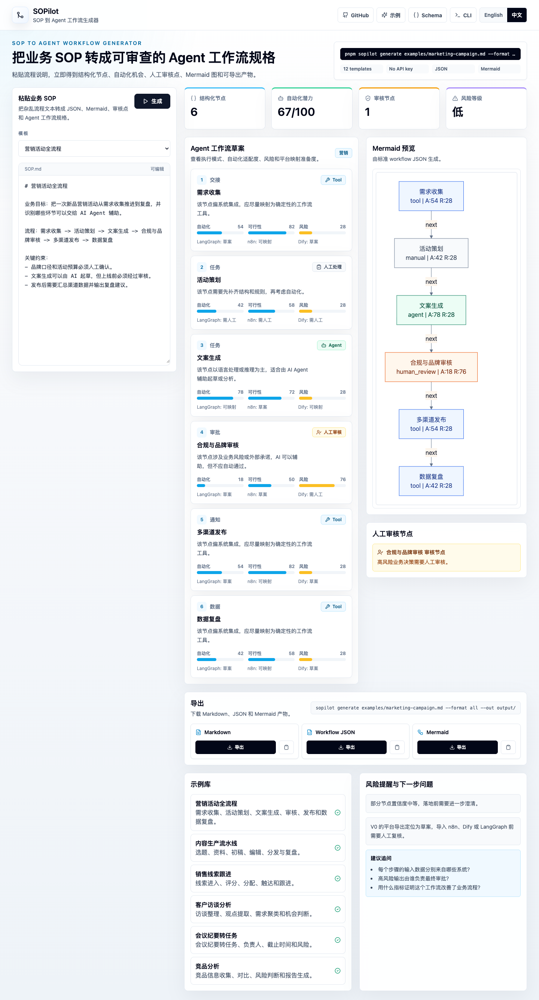

# SOPilot

**把杂乱业务 SOP 转成结构化、可审查、可导出的 AI Agent 工作流规格。**

[English README](README.md) · [快速开始](#快速开始) · [示例](#示例) · [Schema](docs/schema.md) · [Adapter Roadmap](docs/adapter-roadmap.md)


SOPilot 是一个开源的 **SOP-to-Agent Workflow Generator**。输入一段 SOP、会议纪要或业务流程说明，它会生成一份业务、产品、数据、技术团队都能共同评审的 Agent 工作流草案。

> SOPilot 不是 AI 文案生成器。它站在 n8n、Dify、LangGraph 之前，把模糊业务文本转成可 diff、可审查、可导出的工作流规格。



## Before / After

```text
输入：
"需求收集 -> 活动策划 -> 文案生成 -> 审核 -> 发布 -> 数据复盘"

输出：
- 6 个结构化 SOP 节点
- AI 自动化机会分析
- Agent / Tool / Human Review 设计
- 人工审核节点
- Mermaid 流程图
- 可导出的 workflow.json、sop.json、evaluation.json、flow.mmd、report.md
```

## 你会得到什么

- **结构化 SOP JSON**：沉淀业务流程事实。
- **Agent 工作流规格**：标注 Agent / Tool / Human Review / Manual 节点。
- **AI 自动化机会图谱**：包含可行性、风险和置信度评分。
- **人工审核点**：覆盖审批、高风险输出和外部承诺。
- **Mermaid 流程图**：从标准 workflow JSON 生成。
- **Markdown / JSON / Mermaid 导出**：用于评审、文档和交接。
- **中英文 Web UI**：兼顾 GitHub 传播和中文面试演示。

## 为什么做 SOPilot

很多 AI 工作流项目不是失败在代码，而是失败在实现之前：业务流程不清晰、责任人不明确、风险节点无人审核、生成的工作流不可 diff。

SOPilot 只聚焦上游设计层：

```text
业务 SOP -> 结构化 SOP -> AI 机会识别 -> Agent 工作流草案 -> 人工审核点 -> 导出
```

它不替代工作流平台，而是先生成一份干净、可审查的规格，后续可以映射到 n8n、Dify、LangGraph 或企业内部自动化系统。

## 快速开始

```bash
pnpm install
pnpm build
pnpm dev
```

打开本地 Web 应用，粘贴 SOP 即可体验。默认演示路径**不需要 API Key**。

运行 CLI：

```bash
pnpm sopilot generate examples/marketing-campaign.md --format all --out output/
```

查看内置模板：

```bash
pnpm sopilot templates
```

生成所有示例输出：

```bash
pnpm generate:examples
```

## 输出产物

SOPilot 导出标准化产物，而不是直接保存原始 LLM 文本：

| 文件 | 用途 |
| --- | --- |
| `sop.json` | 业务流程事实：角色、系统、节点、连线、输入、输出 |
| `workflow.json` | Agent / Tool / Human Review / Manual 节点设计 |
| `evaluation.json` | 覆盖度、模糊度、自动化潜力、提醒和下一步问题 |
| `flow.mmd` | Mermaid 流程图 |
| `report.md` | 给业务、产品、技术团队共审的说明文档 |

## 示例

仓库内置 12 个 SOP 模板：

1. 营销活动全流程
2. 内容生产流水线
3. 销售线索跟进
4. 客户访谈分析
5. 会议纪要转任务
6. 竞品分析
7. 客服工单分流
8. 招聘简历筛选
9. 产品需求分析
10. 周报 / 数据报告生成
11. 用户反馈聚类
12. PRD 评审与风险检查

详见 [docs/examples.md](docs/examples.md)。

## 面试叙事

SOPilot 可以作为“AI 产品经理（营销提效）”作品，完整展示这条能力链路：

```text
业务访谈 -> SOP 结构化 -> AI 机会识别 -> Agent 工作流设计 -> 人工审核 -> IT / 数据团队交接
```

营销活动流程是第一个黄金案例，但项目本身保持通用，可迁移到销售、客服、招聘、产品、数据分析和运营流程。

## 开发者视角

SOPilot 适合被收藏、研究和二次开发：

- `packages/core` 统一承载 schema、deterministic parser、evaluator 和 exporter。
- Web Demo 与 CLI 共用同一条 canonical generation path。
- Zod schema 让输出可校验、可类型推导、可 diff。
- adapter roadmap 明确 n8n / Dify / LangGraph 只做渐进扩展，不在 V0 过度承诺。

## 仓库结构

```text
apps/web              # Next.js Web Demo
packages/core         # Zod schema、parser、evaluator、exporters
packages/cli          # sopilot generate
examples              # 内置 SOP 模板
docs                  # Schema、示例、adapter roadmap
.github/workflows     # CI
```

## 开发验证

```bash
pnpm lint
pnpm typecheck
pnpm test
pnpm build
```

生成 JSON Schema：

```bash
pnpm schema
```

## Roadmap

- V0：schema、Web demo、CLI、examples、JSON / Markdown / Mermaid 导出。
- V0.2：LangGraph draft exporter。
- V0.3：experimental n8n JSON，优先支持常见节点。
- V0.4：等 Dify workflow 格式稳定后再做草案导出。

详见 [docs/adapter-roadmap.md](docs/adapter-roadmap.md)。

## V0 不做什么

- 不做用户账号
- 不上数据库
- 不做企业级工作流执行引擎
- 不做复杂画布编辑器
- 不承诺 n8n / Dify / LangGraph 的生产可运行导入

V0 聚焦上游设计层：结构化、自动化机会、人工审核和导出。

## License

MIT
