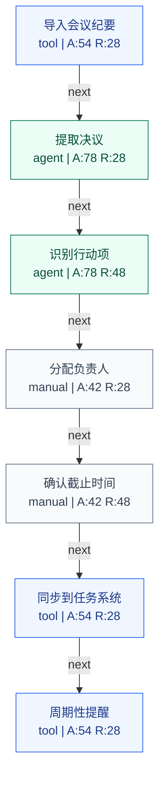

# Meeting Notes to Tasks

Domain: operations

## Summary

- SOP nodes: 7
- Automation potential: 71/100
- Human review gates: 0
- Risk level: low

## Workflow Diagram

## Node Automation Map

| Step | Type | Mode | Automation | Risk | Rationale |
| --- | --- | --- | ---: | ---: | --- |
| 导入会议纪要 | data | tool | 54 | 28 | This step is integration-heavy and should be mapped to deterministic workflow tools where possible. |
| 提取决议 | task | agent | 78 | 28 | This step is language-heavy or reasoning-heavy and is a strong fit for an AI drafting or analysis agent. |
| 识别行动项 | decision | agent | 78 | 48 | This step is language-heavy or reasoning-heavy and is a strong fit for an AI drafting or analysis agent. |
| 分配负责人 | task | manual | 42 | 28 | This step needs clearer structure before automation should be attempted. |
| 确认截止时间 | decision | manual | 42 | 48 | This step needs clearer structure before automation should be attempted. |
| 同步到任务系统 | notification | tool | 54 | 28 | This step is integration-heavy and should be mapped to deterministic workflow tools where possible. |
| 周期性提醒 | notification | tool | 54 | 28 | This step is integration-heavy and should be mapped to deterministic workflow tools where possible. |

## Human Review Gates

- No explicit review gate detected. Add one before production use if the workflow touches external commitments, private data, or approvals.

## Adapter Readiness

| Step | LangGraph | n8n | Dify |
| --- | --- | --- | --- |
| 导入会议纪要 | draft | ready | draft |
| 提取决议 | ready | draft | ready |
| 识别行动项 | ready | draft | ready |
| 分配负责人 | manual | manual | manual |
| 确认截止时间 | manual | manual | manual |
| 同步到任务系统 | draft | ready | draft |
| 周期性提醒 | draft | ready | draft |

## Warnings

- No human review gate was detected; validate risk and approval requirements.
- Some nodes have medium confidence and should be clarified before implementation.
- Adapter exports are draft-oriented in V0 and should be reviewed before importing into n8n, Dify, or LangGraph.

## Recommended Next Questions

- Which systems hold the input data for each step?
- Who owns the final approval for high-risk outputs?
- What metric proves that this workflow improved the business process?
