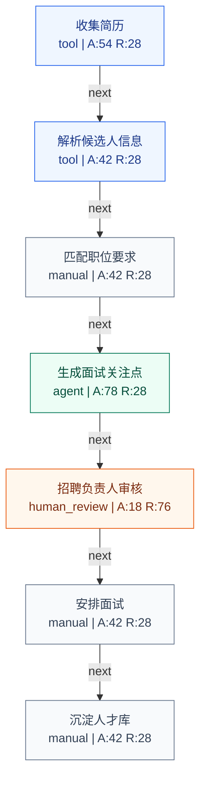

# Recruiting Resume Screening

Domain: recruiting

## Summary

- SOP nodes: 7
- Automation potential: 43/100
- Human review gates: 1
- Risk level: low

## Workflow Diagram

## Node Automation Map

| Step | Type | Mode | Automation | Risk | Rationale |
| --- | --- | --- | ---: | ---: | --- |
| 收集简历 | data | tool | 54 | 28 | This step is integration-heavy and should be mapped to deterministic workflow tools where possible. |
| 解析候选人信息 | data | tool | 42 | 28 | This step is integration-heavy and should be mapped to deterministic workflow tools where possible. |
| 匹配职位要求 | task | manual | 42 | 28 | This step needs clearer structure before automation should be attempted. |
| 生成面试关注点 | task | agent | 78 | 28 | This step is language-heavy or reasoning-heavy and is a strong fit for an AI drafting or analysis agent. |
| 招聘负责人审核 | approval | human_review | 18 | 76 | This step affects business risk or external commitments, so AI should assist but not auto-approve. |
| 安排面试 | task | manual | 42 | 28 | This step needs clearer structure before automation should be attempted. |
| 沉淀人才库 | task | manual | 42 | 28 | This step needs clearer structure before automation should be attempted. |

## Human Review Gates

- **招聘负责人审核 review gate**: High-risk business decision requires review. Reviewer: Business owner or domain reviewer.

## Adapter Readiness

| Step | LangGraph | n8n | Dify |
| --- | --- | --- | --- |
| 收集简历 | draft | ready | draft |
| 解析候选人信息 | draft | ready | draft |
| 匹配职位要求 | manual | manual | manual |
| 生成面试关注点 | ready | draft | ready |
| 招聘负责人审核 | draft | draft | manual |
| 安排面试 | manual | manual | manual |
| 沉淀人才库 | manual | manual | manual |

## Warnings

- Some nodes have medium confidence and should be clarified before implementation.
- Adapter exports are draft-oriented in V0 and should be reviewed before importing into n8n, Dify, or LangGraph.

## Recommended Next Questions

- Which systems hold the input data for each step?
- Who owns the final approval for high-risk outputs?
- What metric proves that this workflow improved the business process?
