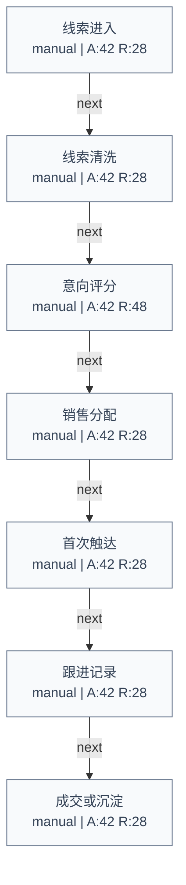

# Sales Lead Follow-up

Domain: sales

## Summary

- SOP nodes: 7
- Automation potential: 0/100
- Human review gates: 0
- Risk level: low

## Workflow Diagram

## Node Automation Map

| Step | Type | Mode | Automation | Risk | Rationale |
| --- | --- | --- | ---: | ---: | --- |
| 线索进入 | task | manual | 42 | 28 | This step needs clearer structure before automation should be attempted. |
| 线索清洗 | task | manual | 42 | 28 | This step needs clearer structure before automation should be attempted. |
| 意向评分 | decision | manual | 42 | 48 | This step needs clearer structure before automation should be attempted. |
| 销售分配 | task | manual | 42 | 28 | This step needs clearer structure before automation should be attempted. |
| 首次触达 | task | manual | 42 | 28 | This step needs clearer structure before automation should be attempted. |
| 跟进记录 | task | manual | 42 | 28 | This step needs clearer structure before automation should be attempted. |
| 成交或沉淀 | task | manual | 42 | 28 | This step needs clearer structure before automation should be attempted. |

## Human Review Gates

- No explicit review gate detected. Add one before production use if the workflow touches external commitments, private data, or approvals.

## Adapter Readiness

| Step | LangGraph | n8n | Dify |
| --- | --- | --- | --- |
| 线索进入 | manual | manual | manual |
| 线索清洗 | manual | manual | manual |
| 意向评分 | manual | manual | manual |
| 销售分配 | manual | manual | manual |
| 首次触达 | manual | manual | manual |
| 跟进记录 | manual | manual | manual |
| 成交或沉淀 | manual | manual | manual |

## Warnings

- No human review gate was detected; validate risk and approval requirements.
- Some nodes have medium confidence and should be clarified before implementation.
- Adapter exports are draft-oriented in V0 and should be reviewed before importing into n8n, Dify, or LangGraph.

## Recommended Next Questions

- Which systems hold the input data for each step?
- Who owns the final approval for high-risk outputs?
- What metric proves that this workflow improved the business process?
